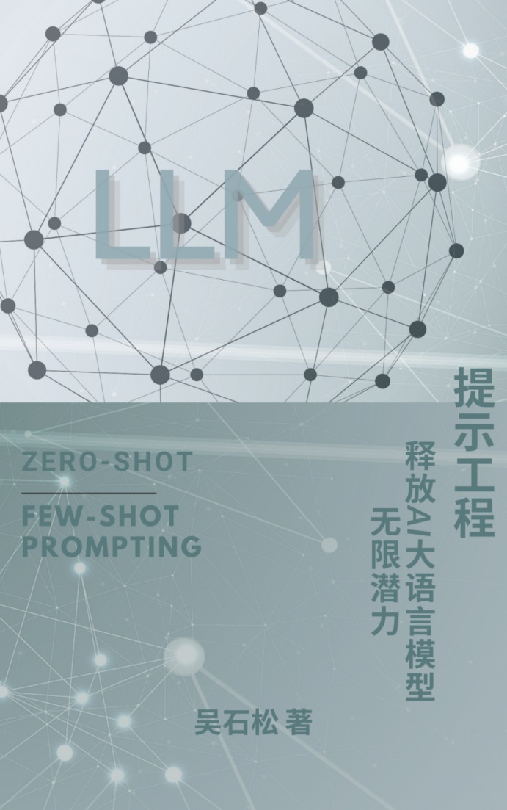

# PromptEngineering
A book about Prompt Engineering in LLMs.

[本书亚马逊国际出版。](https://www.amazon.com/dp/B0C6FGQR3G)

- [前言](./book/0%20前言.pdf)
- [简介](./book/0%20内容简介.pdf)
- [1 高级提示技巧](./book/1.高级提示技巧.pdf)
- [2 迭代和改进提示](./book/2.迭代和改进提示.pdf)
- [3 评估和测试提示](./book/3.评估和测试提示.pdf)
- [4 实践案例](./book/4.实践案例.pdf)
- [5 自定义微调](./book/5.自定义微调.pdf)
- [6 特定领域的提示工程](./book/6.特定领域的提示工程.pdf)
- [7 多语言和跨文化提示工程](./book/7.多语言和跨文化提示工程.pdf)
- [8 错误分析和故障排除](./book/8.错误分析和故障排除.pdf)
- [9 道德规范和责任](./book/9.道德规范和责任.pdf)
- [10 掌握最新动态](./book/10.掌握最新动态.pdf)
- [11 未来展望和挑战](./book/11.未来展望和挑战.pdf)
- [12 后记](./book/12.后记.pdf)
- [13 参考资料](./book/13.参考资料.pdf)

